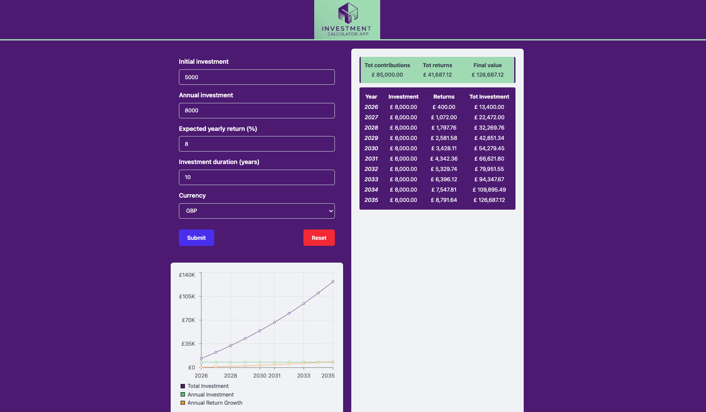

# INVESTMENT CALCULATOR

An interactive **Investment Calculator** built with **React + TypeScript**, allowing users to visualize the growth of their investments over time with dynamic charts.



## 🚀 Features

- 👥 **User Input Form** – Enter **initial investment**, **annual contributions**, **expected growth rate**, and **duration**.
- 📉 **Year-to-Year Investment Breakdown** – Displays:
  - **Year** – Each investment year is listed sequentially.
  - **Annual Investment** – Contributions made for each year.
  - **Returns** – The yearly profit from compounded interest.
  - **Total Investment** – The cumulative value over time.
- 📊 **Interactive Chart** – Visualize investment growth over time using Recharts. Displays:
  - **Total Investment** (cumulative value over time)
  - **Annual Investment** (yearly contributions)
  - **Annual Return Growth** (compounded interest/profit)
- 📋 **Custom Legend** – Toggle different investment metrics in the graph.
- 💲 **Currency Formatting** – Supports multiple currencies with proper formatting.

## 🛠️ Tech Stack

- **React + TypeScript** – For a strongly typed, scalable frontend.
- **Recharts** – To render interactive charts.
- **Tailwind CSS** – For styling and layout.
- **Vitest** – For testing.

## 📦 Installation

1. Clone the repository:

   ```bash
   git clone https://github.com/your-username/investment-calculator.git
   ```

2. Cd into project and install dependencies.

   ```bash
   cd investmentcalculator
   npm install
   ```

3. Run the app

   ```bash
   npm run dev
   ```

## 🎯 Goals:

- [x] Build an accessible responsive form for the user to interact with the investment calculator.
- [x] Display the calculated data, year by year.
- [x] Visually display the investment prograssion in a chart.

## 🔥 Future Enhancements

- [ ] Add **Dark Mode**
- [ ] Implement **export to PDF/CSV** feature
- [ ] Allow users to select different **compounding frequencies** (monthly, quarterly, yearly)
- [ ] Allow users to adjust **annual investment** dynamically and update the data & chart in real time.
