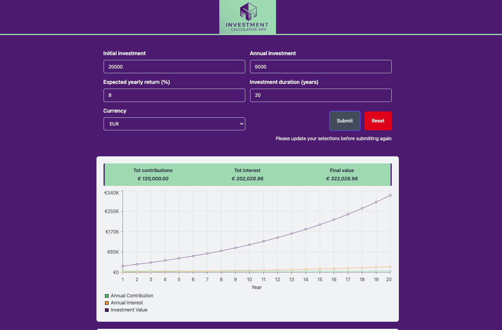

# INVESTMENT CALCULATOR

An interactive **Investment Calculator** built with **React + TypeScript**, allowing users to visualize the growth of their investments over time with dynamic charts. <a href="https://paologhidoni.github.io/investmentcalculator/" target="_blank">🚀 Live Demo: Investment Calculator</a>




## 🚀 Features

- 👥 **User Input Form** – Enter **initial investment**, **annual contributions**, **expected growth rate**, **duration** and **currency**.

- 📊 **Investment Chart** – Visualize investment growth over time using Recharts. Displays:

  - **Annual Contribution** - Contributions made for each year.
  - **Annual Interest** - The yearly profit from compounded interest.
  - **Investment Value** - The cumulative value over time.

- 📋 **Custom Legend** – Toggle different investment metrics in the graph.

- 📉 **Investment Breakdown** – Displays:

  - **Year** – Each investment year is listed sequentially.
  - **Contribution** – Contributions made for each year.
  - **Interest** – The yearly profit from compounded interest.
  - **Investment Value** – The cumulative value over time.

## 🛠️ Tech Stack

- **React + TypeScript** – For a strongly typed, scalable frontend.
- **Recharts** – To render interactive charts.
- **Tailwind CSS** – For styling and layout.
- **Vitest** – For testing.

## 🚀 Accessibility Achievement

I'm proud to share that this project has achieved a **100% accessibility** score on Lighthouse. By focusing on accessibility best practices, I've worked to create an inclusive experience for everyone, regardless of their needs.

This achievement reflects:

- Adherence to WCAG guidelines.
- Optimization of semantic HTML.
- Full keyboard navigability.
- Testing and optimization for VoiceOver on macOS to ensure content is read clearly and navigable.
- Effective ARIA attributes.

## 📦 Installation

1. Clone the repository:

   ```bash
   git clone https://github.com/your-username/investment-calculator.git
   ```

2. Cd into project and install dependencies.

   ```bash
   cd investmentcalculator
   npm install
   ```

3. Run the app

   ```bash
   npm run dev
   ```

## Investment Projection Breakdown

This breakdown helps you track how your investment grows over time and understand the impact of both contributions and returns.

At the moment, it is **assumed that the initial investment is made at the start of year 1**, and each **annual contribution is made at the end of each year**.

The **Interest** is calculated based on the total investment at the beginning of the year, including any previous year's contributions and interest.

Below is an example of how the investment projection is calculated and displayed:

| Year | Contribution        | Interest            | Investment Value                                |
| ---- | ------------------- | ------------------- | ----------------------------------------------- |
| 1    | Annual Contribution | Calculated Interest | Initial Investment + Contribution + Interest    |
| 2    | Annual Contribution | Calculated Interest | Previous Year’s Value + Contribution + Interest |
| 3    | Annual Contribution | Calculated Interest | Previous Year’s Value + Contribution + Interest |
| 4    | Annual Contribution | Calculated Interest | Previous Year’s Value + Contribution + Interest |
| 5    | Annual Contribution | Calculated Interest | Previous Year’s Value + Contribution + Interest |

### Explanation of Columns:

- **Year**: The year of the projection.
- **Contribution**: The total amount invested in that year.
- **Interest**: The calculated interest return for that year, based on the total investment and expected return rate.
- **Investment Value**: The total investment value at the end of the year, including:
  - The **initial investment** (included in the first year only),
  - The **annual contributions**,
  - The **annual interest returns**, and
  - And the accumulated value from previous years.

## 🎯 Goals:

- [x] Build an accessible responsive form for the user to interact with the investment calculator.
- [x] Display the calculated data, year by year.
- [x] Visually display the investment prograssion in a chart.

## 🔥 Future Enhancements

- [ ] **Implement a stacked bar chart** to visualize the yearly data, with each column representing the contribution, interest, and investment value separately.
- [ ] Make it a full stack app with **authentication** and feature to **save investment calculation**.
- [ ] Implement **export to PDF/CSV** feature.
- [ ] Allow user to select whether the **contribution** is made at the **start or end of the year**.
- [ ] Implement the ability to **choose the contribution frequency**, allowing users to select from different options (monthly, quarterly, yearly).
- [ ] Allow users to **select different compounding frequencies** (monthly, quarterly, yearly).
- [ ] Add **tootltips** to explain each field.
- [ ] Add **Dark Mode**.
